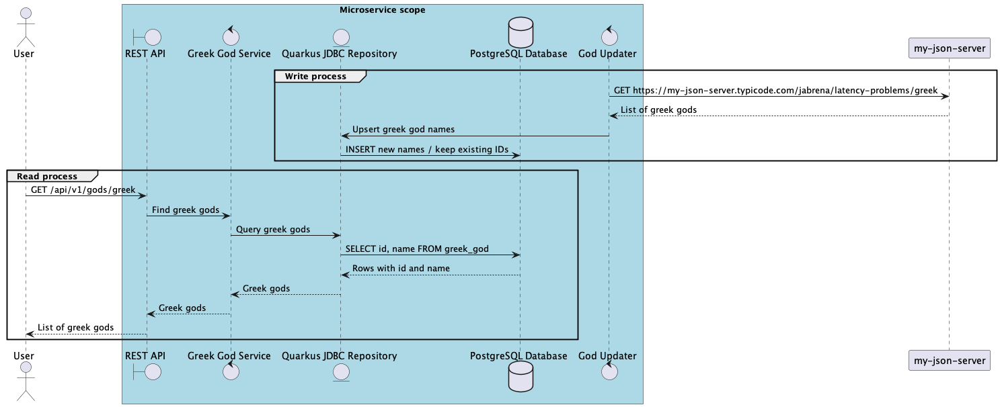

# Problem

Develop a REST API which read Greek god data which it is synchronized periodically from a third party service.

The third-party service returns Greek god names as a JSON array of strings:

```json
["Zeus", "Hera"]
```

The internal database maps those names to records with a stable generated
identifier and the god name:

```json
[
  { "id": 1, "name": "Zeus" },
  { "id": 2, "name": "Hera" }
]
```

Use `name` as the natural key during synchronization. Existing rows keep their
current `id`; new names are inserted with generated IDs.

## Artifacts

- [Acceptance scenarios](./greek_gods.feature)
- [Greek Gods REST API OpenAPI contract](./greekController-oas.yaml)
- [External My JSON Server OpenAPI contract](./my-json-server-oas.yaml)
- [Database schema](./schema.sql)
- [Sequence diagram source](./uml-sequence-diagram.plantuml)
- [Sequence diagram](./uml-sequence-diagram.png)
- [Component diagram](./structurizr-1-Component-001.png)


