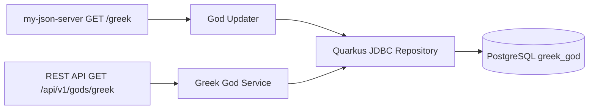

# US-001 Greek Gods API Implementation Plan

**Artifacts:** [US-001_API_Greek_Gods_Data_Retrieval.md](US-001_API_Greek_Gods_Data_Retrieval.md) · [US-001_api_greek_gods_data_retrieval.feature](US-001_api_greek_gods_data_retrieval.feature) · **Last updated:** 2026-08-09

---

## Requirements Summary

**User Story:** As an API consumer, I want to retrieve Greek god records via
**`GET /api/v1/gods/greek`** so applications can use synchronized mythology
data from the local service.

**Key business rules:**

- **Read path:** Responses come from PostgreSQL. Successful responses return
  **200** + `application/json` array of objects with `id` and `name`.
- **Sync path:** A background updater fetches
  `GET https://my-json-server.typicode.com/jabrena/latency-problems/greek`,
  parses an array of strings, and upserts into `greek_god` by unique `name`.
- **Identity rule:** Existing rows keep their generated `id`; new names receive
  generated IDs.
- **Contract:** The public OpenAPI contract is
  [greekController-oas.yaml](../design/greekController-oas.yaml). The external
  OpenAPI contract is [my-json-server-oas.yaml](../design/my-json-server-oas.yaml).
- **Stack:** Quarkus 3.x with REST, JDBC, PostgreSQL, and a scheduler, as
  documented in [ADR-003](../design/ADR-003-Greek-Gods-API-Technology-Stack.md).
- **Testing:** Acceptance tests map to
  [US-001_api_greek_gods_data_retrieval.feature](US-001_api_greek_gods_data_retrieval.feature)
  and validate the `id`/`name` response shape.

---

## Approach

Build the read API and local persistence first, then add the synchronization
worker behind the database contract. The API must not proxy the external JSON
server during read requests.

**Detail:** [greek_gods_api_sequence_diagram.puml](../design/greek_gods_api_sequence_diagram.puml)

---

## Task List

| # | Task | Phase | TDD | Milestone | Parallel | Status |
|---|------|-------|-----|-----------|----------|--------|
| 1 | Create or update the Quarkus Maven service with REST, JDBC datasource, PostgreSQL driver, scheduler, and test dependencies | Setup | | | A1 | Todo |
| 2 | **RED:** Add acceptance test for `GET /api/v1/gods/greek` returning `200`, JSON array, and objects containing integer `id` and string `name` | RED | Test | | A1 | Todo |
| 3 | **GREEN:** Add schema migration matching [schema.sql](../design/schema.sql), repository query for `SELECT id, name FROM greek_god`, service, and REST endpoint | GREEN | Impl | | A1 | Todo |
| 4 | **Verify:** Run the module build and acceptance tests; fix failures before continuing | Verify | | milestone | A1 | Todo |
| 5 | **RED:** Add synchronization test where the upstream `/greek` response is an array of strings and existing rows keep IDs | RED | Test | | A2 | Todo |
| 6 | **GREEN:** Implement the scheduled updater, external client call, and `name`-based upsert | GREEN | Impl | | A2 | Todo |
| 7 | **Verify:** Run the module build and sync tests; confirm upsert behavior and stable IDs | Verify | | milestone | A2 | Todo |
| 8 | Align runtime OpenAPI generation or static documentation with [greekController-oas.yaml](../design/greekController-oas.yaml) | Docs | | | A3 | Todo |
| 9 | **Verify:** Confirm Gherkin coverage for both listed scenarios and review API documentation for `id`/`name` consistency | Verify | | milestone | A3 | Todo |

---

## Execution Instructions

1. Implement only the benchmark scenario target selected by the campaign.
2. Keep the public API payload as records with `id` and `name`; do not return
   a bare array of strings.
3. Keep the external service payload as an array of strings.
4. Use `name` as the synchronization natural key and preserve existing IDs.
5. Update this task list as work is completed.
6. Run the relevant module verification before promoting implementation work.

---

## File Checklist

| Order | File |
|-------|------|
| 1 | `pom.xml` |
| 2 | `src/main/resources/application.properties` or `application.yml` |
| 3 | `src/main/resources/db/migration/V1__greek_god.sql` |
| 4 | `src/main/java/.../GreekGod.java` |
| 5 | `src/main/java/.../GreekGodRepository.java` |
| 6 | `src/main/java/.../GreekGodService.java` |
| 7 | `src/main/java/.../GreekGodResource.java` |
| 8 | `src/main/java/.../GodUpdater.java` |
| 9 | `src/test/java/.../GreekGodResourceTest.java` |
| 10 | `src/test/java/.../GodUpdaterTest.java` |

---

## Related Documentation

| Artifact | Path |
|----------|------|
| User story | [US-001_API_Greek_Gods_Data_Retrieval.md](US-001_API_Greek_Gods_Data_Retrieval.md) |
| Gherkin | [US-001_api_greek_gods_data_retrieval.feature](US-001_api_greek_gods_data_retrieval.feature) |
| This plan | [PLAN-US-001_Implementation.plan.md](PLAN-US-001_Implementation.plan.md) |
| ADR-001 | [../design/ADR-001_REST_API_Functional_Requirements.md](../design/ADR-001_REST_API_Functional_Requirements.md) |
| ADR-002 | [../design/ADR-002-Acceptance-Testing-Strategy.md](../design/ADR-002-Acceptance-Testing-Strategy.md) |
| ADR-003 | [../design/ADR-003-Greek-Gods-API-Technology-Stack.md](../design/ADR-003-Greek-Gods-API-Technology-Stack.md) |
| Public OpenAPI | [../design/greekController-oas.yaml](../design/greekController-oas.yaml) |
| External OpenAPI | [../design/my-json-server-oas.yaml](../design/my-json-server-oas.yaml) |
| Schema | [../design/schema.sql](../design/schema.sql) |
| Sequence diagram | [../design/greek_gods_api_sequence_diagram.puml](../design/greek_gods_api_sequence_diagram.puml) |
